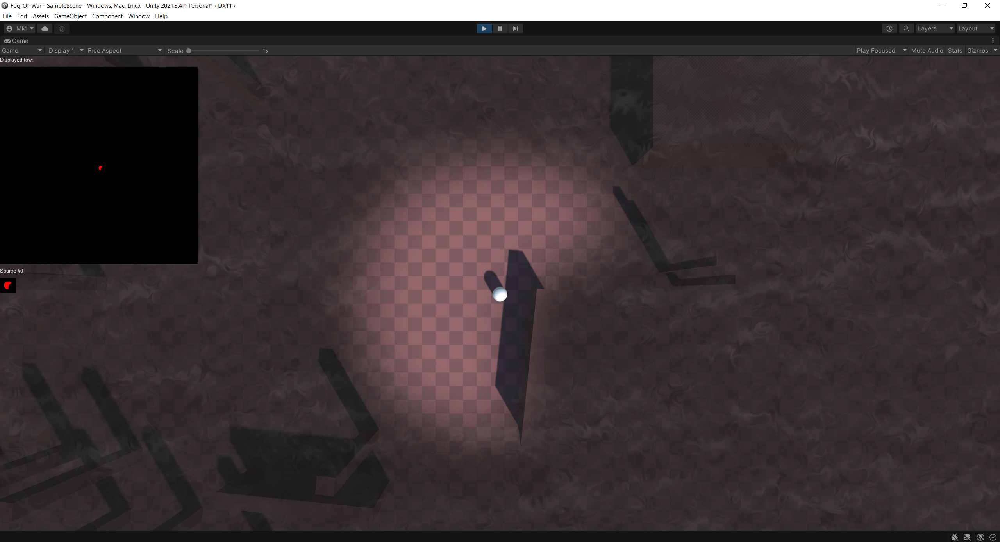
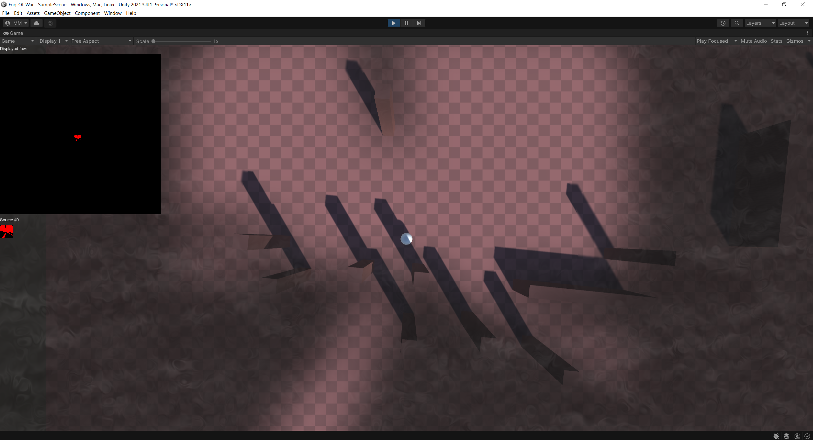
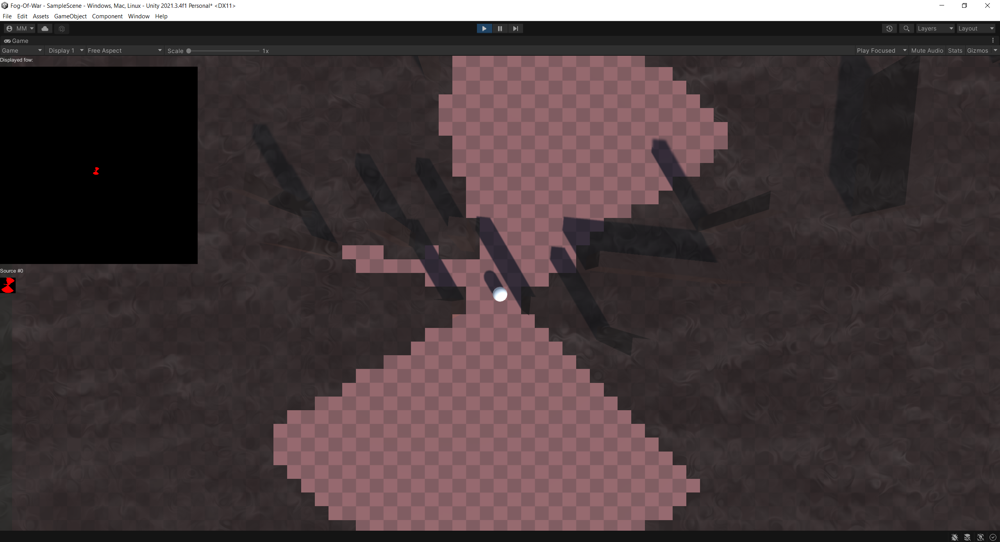

A dynamic tile-based fog of war system. Supports multiple fog revealers with dynamic radiuses.
Uses compute shaders for visuls with optional smoothing and blending to hide tile based nature. Allows C# fog sampling.

